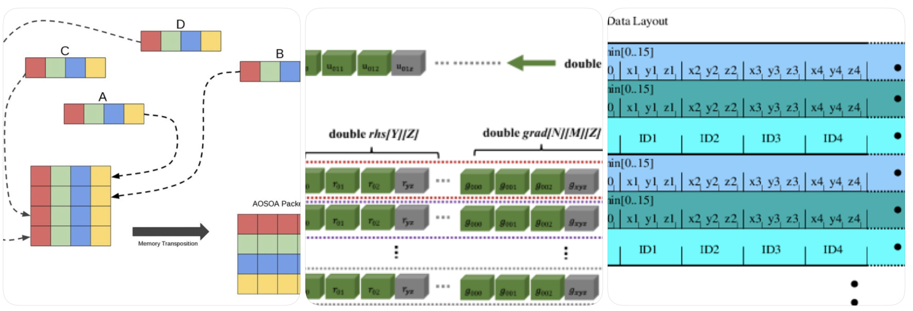

Hybrid Layout (AoSoA / Tiled SoA)
-

Modern HPC uses the `Array-of-Structures-of-Arrays (AoSoA)` aka "Tiled SoA"
approach, the structure looks like:



```pre
Tile[0]:
    x[VL], y[VL], z[VL], m[VL]
Tile[1]:
    x[VL], y[VL], z[VL], m[VL]
...
```

Where `VL = SIMD width (4/8/16/32)` and gives the following characteristics:

* Vectorization within each `tile`,
* Good per-object locality,
* Excellent cache behavior

1. Mojo version of AoS vs SoA

*

1.1 AoS in Mojo (conceptual)
--

Going back to the particles _simulation_ earlier used to illustrate the concept, here's how it can be represented in Mojo:

```mojo
struct Particle(Copyable, ImplicitlyCopyable):
    var x: Float32
    var y: Float32
    var z: Float32
    var vx: Float32
    var vy: Float32
    var vz: Float32

# Array-of-Structures: contiguous particles[]
fn update_positions_aos(var particles: List[Particle], dt: Float32):
    var n = len(particles)
    for i in range(n):
        # Load one particle (brings x,y,z,vx,vy,vz into cache)
        var p = particles[i]
        p.x += p.vx * dt
        p.y += p.vy * dt
        p.z += p.vz * dt
        particles[i] = p
```

The takeaways are:

* Memory layout is `[x y z vx vy vz][x y z vx vy vz]...`
* Good when you always work per particle and use most fields.
* Harder for SIMD/GPU because consecutive access to `x` values of particles are _strided in memory_.

1.2 SoA in Mojo
--

Now, we examine how it looks like in SoA form:

```mojo
struct ParticlesSoA(Copyable,ImplicitlyCopyable):
    var x: List[Float32]
    var y: List[Float32]
    var z: List[Float32]
    var vx: List[Float32]
    var vy: List[Float32]
    var vz: List[Float32]

    fn __init__(out self, n: Int):
        self.x = List[Float32](fill=0, length=n)
        self.y = List[Float32](fill=0, length=n)
        self.z = List[Float32](fill=0, length=n)
        self.vx = List[Float32](fill=0, length=n)
        self.vy = List[Float32](fill=0, length=n)
        self.vz = List[Float32](fill=0, length=n)

fn update_positions_soa(mut p: ParticlesSoA, dt: Float32):
    let n = len(p.x)
    for i in range(n):
        p.x[i] += p.vx[i] * dt
        p.y[i] += p.vy[i] * dt
        p.z[i] += p.vz[i] * dt
```

The takeaways are:

* Memory layout is `xxx....yyy....zzz....vxvxvx....vyvy....vzvz...`
* Loops over x / vx can become perfectly vectorizable and GPU-friendly.
* It definitely increases the opportunities to add SIMD primitives or Mojo's vector types.

2. Numba/CUDA: AoS vs SoA and Coalescing
--
Here is a minimal setup that you can paste into a notebook, if you wish. The setup proceeds to encode particles as [x, y, z, mass] in AoS.

```python
import numpy as np
from numba import cuda
import time

N = 100_000_000 # ~ 100 mil elements

# AoS: shape (N, 4)  => [x, y, z, mass]
particles_aos = np.zeros((N, 4), dtype=np.float32)
particles_aos[:, 0] = np.linspace(0, 1, N)  # x
particles_aos[:, 1] = 1.0                   # y
particles_aos[:, 2] = 2.0                   # z
particles_aos[:, 3] = 3.0                   # mass

# SoA: 4 separate arrays
x = particles_aos[:, 0].copy()
y = particles_aos[:, 1].copy()
z = particles_aos[:, 2].copy()
m = particles_aos[:, 3].copy()

# kernel: AoS access (poor Coalescing)
@cuda.jit
def scale_x_aos(particles, factor):
    i = cuda.grid(1)
    if i < particles.shape[0]:
        particles[i, 0] *= factor

# Contiguous x[i] gives fully coalesced loads for a warp
@cuda.jit
def scale_x_soa(x, factor):
    i = cuda.grid(1)
    if i < x.size:
        x[i] *= factor


threads_per_block = 256
blocks = (N + threads_per_block - 1) // threads_per_block

def computation_via_aos():
    d_aos = cuda.to_device(particles_aos)

    start = time.perf_counter()
    scale_x_aos[blocks, threads_per_block](d_aos, 1.1)
    cuda.synchronize()
    t_aos = time.perf_counter() - start
    print("AoS kernel time:", t_aos, "s")
    return t_aos


def computation_via_soa():
    d_x = cuda.to_device(x)

    start = time.perf_counter()
    scale_x_soa[blocks, threads_per_block](d_x, 1.1)
    cuda.synchronize()
    t_soa = time.perf_counter() - start
    print("SoA kernel time:", t_soa, "s")
    return t_soa


if __name__ == "__main__":
    (t_aos, t_soa) = (computation_via_aos(), computation_via_soa())
    print("Speedup (AoS / SoA): ", t_aos / t_soa)

```

Let's take a step back from the code and you saw and read (probably);
re-focusing on the conceptual aspects of the algorithm and this is where the
visualization can play a significant role.

1.3 Representational View of AoS SoA structures
--

I do believe in developing the correct visual mental model, as its remarkably
useful when it comes to developing and debugging your kernels. In the AoS model,
it reflects the mental of the _computer programmer_ (i should really use the
terms of software developer or software engineer).

AoS layout

```
// C:
struct Particle {
    float x, y, z, mass;
};

Particle particles[N];

Memory:

address →
+----------------+----------------+----------------+----------------+---
| x0 | y0 | z0 | m0 | x1 | y1 | z1 | m1 | x2 | y2 | z2 | m2 | ...
+----------------+----------------+----------------+----------------+---
```

In the SoA scenario, the structure looks a little funny as its not a mental
model we are accustomed. It does not reflect the way the programmers from the
1990s, though it would be really familiar to people whom are familiar with
array-based programming languages.

SoA layout

```
struct Particles {
    float x[N];
    float y[N];
    float z[N];
    float mass[N];
};

Memory:

address →
x: [ x0 | x1 | x2 | x3 | ... | xN-1 ]
y: [ y0 | y1 | y2 | y3 | ... | yN-1 ]
z: [ z0 | z1 | z2 | z3 | ... | zN-1 ]
m: [ m0 | m1 | m2 | m3 | ... | mN-1 ]
```

1.4 Warp / SIMD diagram (for coalescing)
--

This subsection is to help readers understand how memory coalescing woks in the
super-computing age. For simplicity sake, let's assume the a warp of 8 threads
are used:

```pre
Warp (8 threads) reading x:

Thread IDs:  0    1    2    3    4    5    6    7

AoS (stride = sizeof(Particle)):
    addr:   x0   x1   x2   x3   x4   x5   x6   x7
    layout: [x0 y0 z0 m0][x1 y1 z1 m1]...

    → 8 scattered 16-byte apart segments

SoA:
    addr:   x0 x1 x2 x3 x4 x5 x6 x7 (contiguous)

    → 1 coalesced segment (ideally)
```

In the other perspective, the mental picture which i find to be quite intuitive
would be to imagine the kitchen split into tiles and each tile is exactly the
same as the other. Here's what AoSoA/Tiled SoA looks like

```pre
Vector length VL = 4

Tile 0:
    x[0..3], y[0..3], z[0..3], m[0..3]

Tile 1:
    x[4..7], y[4..7], z[4..7], m[4..7]

Memory (conceptually):

[x0 x1 x2 x3][y0 y1 y2 y3][z0 z1 z2 z3][m0 m1 m2 m3]
[x4 x5 x6 x7][y4 y5 y6 y7][z4 z5 z6 z7][m4 m5 m6 m7] ...
```
