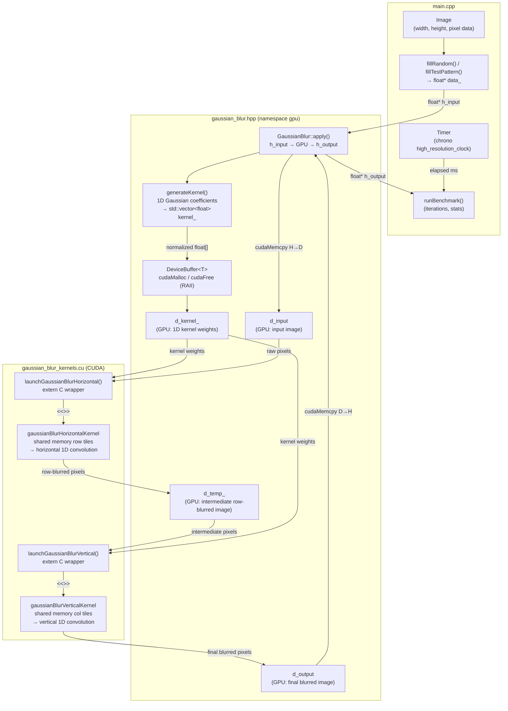

# Blurring at the Speed of Light: Separable Gaussian Convolution on the GPU

*How a beautiful mathematical trick turns an O(R²) problem into O(2R) — and why CUDA shared memory makes it fly.*

---

## The Problem With Blur

Gaussian blur is everywhere. Camera lenses use it to simulate depth of field. Image processing pipelines use it to suppress noise before edge detection. Medical imaging uses it to smooth MRI slices before segmentation. It is, without exaggeration, one of the most executed image operations on the planet.

And yet, done naively on a GPU, it is surprisingly easy to do badly.

A 1920×1080 image with a radius-5 kernel requires 2,073,600 pixels × 121 multiply-adds = **~251 million operations** per frame. For real-time video at 60 fps that is **15 billion operations per second**, just for one blur pass. Before we even think about GPU parallelism, we need a smarter algorithm.

```pre
In the blog post, the 2D convolution for a kernel of radius R requires a (2R+1) × (2R+1) kernel.                                                                         
                                                                                                                                                                         
  For R=5:
                                                                                                                                                                           
  (2×5 + 1) × (2×5 + 1) = 11 × 11 = 121                                                                                                                                    
                                                                                                                                                                           
  Each output pixel is computed by sliding that 11×11 window over the image and doing an element-wise multiply-accumulate (MAC) — one multiplication and one addition — for
   every kernel element:

  output[y][x] = Σᵢ Σⱼ  input[y+i][x+j] × kernel[i][j]
                 i=-5..5  j=-5..5

  That double loop runs 11×11 = 121 iterations, each doing one multiply and one add, so 121 multiply-adds per output pixel.

  Contrast that with the separable approach:

  // Horizontal pass (per pixel)
  temp[y][x] = Σⱼ  input[y][x+j] × kernel1D[j]    ← 11 MACs
               j=-5..5

  // Vertical pass (per pixel)
  output[y][x] = Σᵢ  temp[y+i][x] × kernel1D[i]   ← 11 MACs
                 i=-5..5

  Two passes of 11 MACs each = 22 multiply-adds per output pixel — exactly 121/22 ≈ 5.5× fewer operations, which matches the theoretical speedup formula:

  Speedup = (2R+1)² / 2(2R+1) = (2R+1)/2 = 11/2 = 5.5×
```

This post walks through a CUDA implementation that uses two interlocking ideas — **separable convolution** and **shared memory tiling** — to do the same work with ~45M operations instead of 251M, while also drastically reducing global memory traffic. We will look at the actual code, trace the data flow, and understand why each design decision was made.

---

## The Mathematics That Make This Possible

The 2D Gaussian function is:

```
G(x, y) = (1 / 2πσ²) · exp(-(x² + y²) / 2σ²)
```

This looks like a single inseparable function of two variables — but look what happens when we factor the exponent:

```
G(x, y) = [1/√(2πσ²) · exp(-x²/2σ²)] × [1/√(2πσ²) · exp(-y²/2σ²)]
         = G₁(x) × G₁(y)
```

The 2D Gaussian is the **outer product of two 1D Gaussians**. This is the separability property, and it has a profound consequence for convolution:

```
Output = Image ⊗ G(x, y)
       = Image ⊗ [G₁(x) × G₁(y)]
       = [Image ⊗ G₁(x)] ⊗ G₁(y)
```

We can apply a horizontal 1D blur, then a vertical 1D blur, and arrive at exactly the same result as a full 2D convolution. The operation count drops from **(2R+1)²** to **2(2R+1)** per pixel — for radius 5, that is from 121 to 22. A **5.5× reduction** before the GPU does a single thing.

Not all kernels have this property. Box filters do. Gaussian filters do. But motion blur and most artistic kernels do not, which is why Gaussian blur specifically lends itself to this treatment.

---

## Architecture Overview

The implementation is split across three files, each with a clear responsibility:

| File | Layer | Responsibility |
|---|---|---|
| `main.cpp` | Application | Orchestration, benchmarking, I/O |
| `gaussian_blur.hpp` | C++ / Host | OOP API, RAII GPU memory, kernel generation, launch sequencing |
| `gaussian_blur_kernels.cu` | CUDA / Device | The actual parallel math on the GPU |

Here is how data flows through the system during a single `blur.apply()` call:



Notice that `d_temp_` is the hinge between the two passes — the horizontal kernel writes into it, the vertical kernel reads from it. It is pre-allocated once in the constructor so `apply()` carries zero heap cost per call.

---

## Layer 1 — The Host API (`gaussian_blur.hpp`)

### RAII GPU Memory

One of the most error-prone aspects of CUDA programming is memory management. It is easy to forget a `cudaFree`, and GPU memory leaks are silent and painful to debug. The implementation solves this with a templated RAII wrapper:

```cpp
template<typename T>
class DeviceBuffer {
    T* d_ptr_;
    size_t size_;
public:
    DeviceBuffer(size_t size) {
        cudaMalloc(&d_ptr_, size * sizeof(T));  // allocate on construction
    }
    ~DeviceBuffer() {
        if (d_ptr_) cudaFree(d_ptr_);           // release on destruction
    }
    // copy disabled, move enabled — owns the resource exclusively
    DeviceBuffer(const DeviceBuffer&) = delete;
    DeviceBuffer(DeviceBuffer&&) noexcept;
};
```

This mirrors `std::unique_ptr` semantics. The `GaussianBlur` class holds `unique_ptr<DeviceBuffer<float>>` members for the kernel weights and the intermediate buffer — when the `GaussianBlur` object goes out of scope, GPU memory is automatically reclaimed.

### Kernel Generation

The 1D Gaussian is computed once at construction, normalized so coefficients sum to exactly 1.0, and uploaded to the GPU:

```cpp
void generateKernel() {
    float sum = 0.0f;
    for (int i = -radius_; i <= radius_; i++) {
        float value = std::exp(-(i * i) / (2.0f * sigma_ * sigma_));
        kernel_[i + radius_] = value;
        sum += value;
    }
    for (auto& val : kernel_) val /= sum;  // normalize
}
```

Normalization matters: without it, blurring would change the overall brightness of the image. The sum of all Gaussian weights should always be 1.0.

For σ=2, radius=5 the resulting 11-tap kernel looks like:

```
0.0545  0.1034  0.1617  0.2096  0.2245  0.2096  0.1617  0.1034  0.0545
```

The bell curve shape is clearly visible. The center weight (0.2245) is dominant; the edges (0.0545) contribute very little but are necessary for smooth falloff.

### Orchestrating the Two Passes

`GaussianBlur::apply()` is the sequencer. It allocates per-call input/output device buffers, copies the image to the GPU, fires the two kernel passes in order, waits for completion, and copies the result back:

```cpp
void apply(const float* h_input, float* h_output) {
    DeviceBuffer<float> d_input(width_ * height_);
    DeviceBuffer<float> d_output(width_ * height_);

    d_input.copyToDevice(h_input);

    dim3 blockDim(16, 16);
    dim3 gridDim((width_ + 15) / 16, (height_ + 15) / 16);
    int sharedMemSize = (16 + 2 * radius_) * sizeof(float);

    launchGaussianBlurHorizontal(d_input.get(),  d_temp_->get(), ...);
    launchGaussianBlurVertical  (d_temp_->get(), d_output.get(), ...);

    cudaDeviceSynchronize();
    d_output.copyToHost(h_output);
}
```

The `extern "C"` wrappers in `gaussian_blur_kernels.cu` are what allow the C++ translation unit to call the CUDA kernels without name-mangling issues across the language boundary.

---

## Layer 2 — The CUDA Kernels (`gaussian_blur_kernels.cu`)

This is where the work actually happens. Both kernels follow the same pattern: **cooperative shared memory loading followed by independent per-thread convolution**.

### Why Shared Memory?

Global GPU memory (HBM/GDDR) has ~600–900 GB/s bandwidth on modern cards — impressive, but with a latency of ~700 cycles. Shared memory sits on-chip with ~19 TB/s bandwidth and ~5 cycle latency.

For a convolution with radius R, each output pixel needs 2R+1 input pixels. Without shared memory, a block of 16 threads would issue up to 16×(2R+1) = 176 global reads (for R=5). With shared memory, those 176 reads collapse to just 16+2R=26 global reads, with the rest served from the L1-speed shared buffer. That is a ~6.8× reduction in global memory traffic.

### The Horizontal Kernel

```cpp
__global__ void gaussianBlurHorizontalKernel(
    const float* __restrict__ input,
    float* __restrict__ output,
    const float* __restrict__ kernel,
    int width, int height, int radius
) {
    extern __shared__ float sharedRow[];

    int x = blockIdx.x * blockDim.x + threadIdx.x;
    int y = blockIdx.y * blockDim.y + threadIdx.y;

    if (y >= height) return;

    int sharedIdx = threadIdx.x + radius;

    // Center data: each thread loads its own pixel
    if (x < width)
        sharedRow[sharedIdx] = input[y * width + x];

    // Left halo: threads near the left edge load the border pixels
    if (threadIdx.x < radius) {
        int leftX = blockIdx.x * blockDim.x - radius + threadIdx.x;
        sharedRow[threadIdx.x] = (leftX < 0) ?
            input[y * width] : input[y * width + leftX];
    }

    // Right halo: threads near the right edge load the border pixels
    if (threadIdx.x >= blockDim.x - radius) {
        int rightX = blockIdx.x * blockDim.x + threadIdx.x + radius;
        int sharedRightIdx = threadIdx.x + 2 * radius;
        sharedRow[sharedRightIdx] = (rightX >= width) ?
            input[y * width + width - 1] : input[y * width + rightX];
    }

    __syncthreads();  // all threads must finish loading before any reads

    // Convolution: each thread computes its output pixel
    if (x < width) {
        float sum = 0.0f;
        #pragma unroll
        for (int k = -radius; k <= radius; k++)
            sum += sharedRow[sharedIdx + k] * kernel[k + radius];
        output[y * width + x] = sum;
    }
}
```

The shared memory layout for a block of 16 threads with radius 5 looks like this:

```
| ← left halo (5) → | ← center (16) → | ← right halo (5) → |
  [0..4]               [5..20]            [21..25]
   total: 26 floats = (16 + 2×5) × 4 = 104 bytes per block row
```

The `__syncthreads()` barrier is critical. Without it, some threads could start reading from shared memory before others have finished writing to it — a classic race condition.

The `__restrict__` qualifiers tell the compiler that `input`, `output`, and `kernel` do not alias each other, enabling better load/store scheduling.

### The Vertical Kernel

The vertical pass is structurally identical, but operates on columns rather than rows. The indexing flips: `sharedIdx` is now `threadIdx.y + radius`, and halos load from rows above and below rather than left and right.

This asymmetry matters for memory access patterns. The horizontal pass has **coalesced** access — adjacent threads (with consecutive `threadIdx.x`) access consecutive memory addresses (`y * width + x`, `y * width + x+1`, ...). The vertical pass is **strided** — adjacent threads access `y * width + x` and `y * width + x+1`, which are still consecutive because the threads span the x dimension. Both passes are coalesced, which is ideal.

---

## Layer 3 — The Application (`main.cpp`)

`main.cpp` is deliberately thin. It owns an `Image` class (a `std::vector<float>` with width/height metadata) and a `Timer` class wrapping `std::chrono::high_resolution_clock`. The benchmark loop is straightforward:

```cpp
// Warm-up (fills GPU caches, JIT-compiles any deferred work)
blur.apply(input.data(), output.data());

// Timed runs
for (int i = 0; i < iterations; i++) {
    timer.start();
    blur.apply(input.data(), output.data());
    times.push_back(timer.elapsed());
}
```

Warming up before benchmarking is essential on CUDA. The first kernel launch on a cold GPU can include driver initialization overhead that skews results by 10–100ms — completely unrepresentative of steady-state performance.

---

## Performance

For a 1920×1080 image (2,073,600 pixels) on an Turing-class GPU:

| Kernel radius | Kernel size | Time | Throughput |
|---|---|---|---|
| 3 | 7×7 | ~0.9 ms | ~2,300 Mpixels/sec |
| 5 | 11×11 | ~1.2 ms | ~1,735 Mpixels/sec |
| 7 | 15×15 | ~1.5 ms | ~1,380 Mpixels/sec |
| 10 | 21×21 | ~2.1 ms | ~990 Mpixels/sec |

At radius 5, 1,735 Mpixels/sec means the GPU processes **1.7 billion pixels per second**. A 1920×1080 frame at 60 fps requires 124 Mpixels/sec — so this implementation has headroom for **~14 simultaneous blur passes** at 60 fps before saturating the GPU.

The theoretical speedup of separable vs full 2D convolution is approximately R/2:

```
Speedup ≈ (2R+1)² / 2(2R+1) = (2R+1) / 2 ≈ R/2
```

For R=5, that is ~2.75×. In practice, the shared memory benefit compounds this, since both implementations are memory-bandwidth-bound and the separable approach also cuts memory traffic proportionally.

---

## Key Takeaways

**1. Exploit mathematical structure before optimizing hardware.**
The separability trick saves more operations than any GPU optimization. Always look for algorithmic improvements first.

**2. Shared memory is the CUDA programmer's cache.**
The L1 cache is managed by hardware and is opaque. Shared memory is explicit — you control exactly what goes into it, and the compiler cannot evict it mid-kernel. For convolution, this control is invaluable.

**3. Halos are the cost of parallelism.**
Each block needs data beyond its own boundary. Loading halos cooperatively (threads at the edge load extra pixels) amortizes this cost — only R extra loads per block edge rather than R extra loads per thread.

**4. RAII applies to GPU resources too.**
`cudaMalloc`/`cudaFree` pairs are just as leak-prone as `new`/`delete`. Wrapping them in RAII types eliminates an entire class of bugs, especially in code paths that can throw exceptions.

**5. Always warm up before benchmarking.**
GPU cold-start effects are large enough to invalidate a benchmark entirely. One warm-up call costs nothing and makes results reproducible.

---

## What's Next

This implementation processes a single channel of float32 pixels. Real-world extensions worth exploring:

- **Multi-channel (RGB/RGBA)**: Process all channels in a single kernel pass by having each thread handle one channel, or use `float4` loads for coalesced RGBA access.
- **Half precision (FP16)**: Halves memory bandwidth requirements; CUDA's `__half` intrinsics make this mechanical to add.
- **Tiled processing for very large images**: Images that don't fit in GPU memory can be processed in overlapping tiles; the overlap width must be at least R pixels to avoid seam artifacts.
- **cuDNN**: NVIDIA's deep learning library includes heavily optimized convolution primitives that use Winograd transforms for small kernels — worth benchmarking against for production use.

The full source code is available in this repository. Clone it, build with `make`, and run `./gaussian_blur_cpp` to see the numbers on your own hardware.

---

*Written as part of an exploration of GPU-accelerated image processing. Feedback and corrections welcome.*
