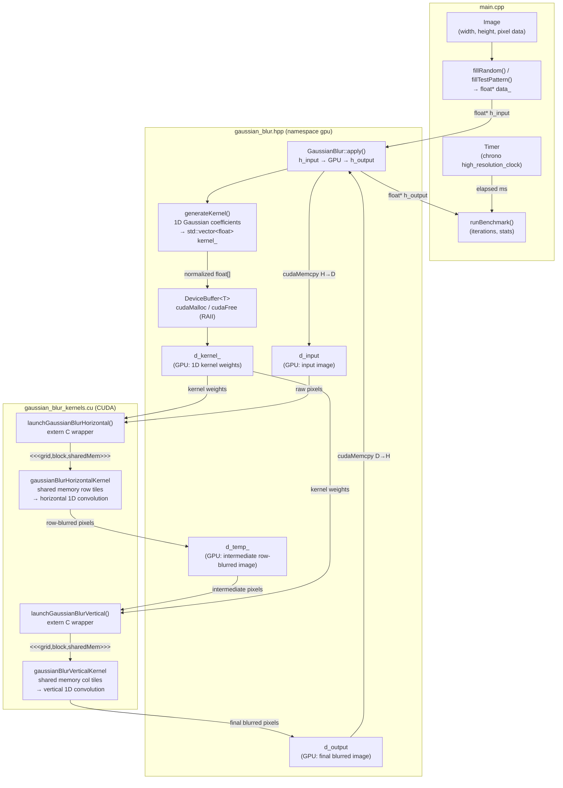

# Gaussian Blur CUDA Implementations

This repository contains two complete implementations of separable Gaussian blur using CUDA:

1. **Standalone CUDA** (`gaussian_blur_cuda.cu`) - Pure CUDA implementation
2. **C++ with CUDA** (`gaussian_blur.hpp`, `gaussian_blur_kernels.cu`, `main.cpp`) - Object-oriented C++ wrapper

Both implementations use **separable convolution** (2 × 1D passes) for optimal performance.

## Features

### Common Features
- ✅ Separable convolution (horizontal + vertical passes)
- ✅ Shared memory optimization for data reuse
- ✅ Efficient halo loading (boundary handling)
- ✅ Configurable kernel radius and sigma
- ✅ Performance benchmarking
- ✅ Loop unrolling for better performance

### C++ Implementation Extras
- ✅ RAII memory management
- ✅ Object-oriented API
- ✅ Exception handling
- ✅ Automatic resource cleanup
- ✅ Easy integration into larger projects

## File Structure

```
.
├── gaussian_blur_cuda.cu          # Standalone CUDA implementation
├── gaussian_blur.hpp               # C++ class interface
├── gaussian_blur_kernels.cu       # CUDA kernels for C++ version
├── main.cpp                       # C++ example application
├── Makefile                       # Build system
└── README.md                      # This file
```

## Data Flow (C++ with CUDA)

The following diagram shows how data moves between `main.cpp`, `gaussian_blur.hpp`, and `gaussian_blur_kernels.cu` during a blur operation:



## Requirements

- NVIDIA GPU with CUDA support (Compute Capability 5.0+)
- CUDA Toolkit (tested with CUDA 11.0+)
- C++ compiler with C++11 support (g++ or clang++)
- Make (for building)

## Compilation

### Quick Start

Build everything:
```bash
make
```

Build specific implementation:
```bash
make gaussian_blur_cuda    # Standalone CUDA
make gaussian_blur_cpp     # C++ with CUDA
```

### GPU Architecture

The Makefile defaults to `sm_75` (Turing architecture). Adjust for your GPU:

```bash
# RTX 30 series (Ampere)
make CUDA_ARCH=sm_80

# RTX 40 series (Ada Lovelace)
make CUDA_ARCH=sm_89

# GTX 10 series (Pascal)
make CUDA_ARCH=sm_60
```

Common architectures:
- `sm_50`: Maxwell (GTX 900 series)
- `sm_60`: Pascal (GTX 10 series)
- `sm_70`: Volta (Tesla V100)
- `sm_75`: Turing (RTX 20 series)
- `sm_80`: Ampere (RTX 30 series, A100)
- `sm_89`: Ada Lovelace (RTX 40 series)

### Manual Compilation

#### Standalone CUDA
```bash
nvcc -arch=sm_75 -O3 --use_fast_math gaussian_blur_cuda.cu -o gaussian_blur_cuda
```

#### C++ with CUDA
```bash
nvcc -arch=sm_75 -O3 -c gaussian_blur_kernels.cu -o gaussian_blur_kernels.o
nvcc -arch=sm_75 -O3 -x cu -c main.cpp -o main.o
nvcc -arch=sm_75 -O3 main.o gaussian_blur_kernels.o -o gaussian_blur_cpp
```

## Usage

### Running

```bash
# Run standalone CUDA version
./gaussian_blur_cuda

# Run C++ version
./gaussian_blur_cpp

# Or use make
make run_cuda
make run_cpp
make run        # Run both
```

### Expected Output

Both implementations will:
1. Initialize test image data
2. Generate Gaussian kernel coefficients
3. Apply blur and measure execution time
4. Display sample output values
5. Run benchmarks with different kernel sizes

Example output:
```
=== Separable Gaussian Blur (C++ with CUDA) ===

Image dimensions: 1920 x 1080
Kernel radius: 5
Sigma: 2.0

Gaussian kernel (radius=5, sigma=2):
0.054489 0.103352 0.161656 0.209616 0.224514 0.209616 0.161656 0.103352 0.054489 

Applying Gaussian blur...
First run completed in 1.234 ms

=== Benchmark Results ===
Iterations: 100
Average time: 1.189 ms
Min time: 1.156 ms
Max time: 1.245 ms
Throughput: 1735.46 Mpixels/sec
```

### Integrating into Your Project

#### Using the C++ Version

```cpp
#include "gaussian_blur.hpp"

int main() {
    const int width = 1920;
    const int height = 1080;
    const int radius = 5;
    const float sigma = 2.0f;
    
    // Create processor
    gpu::GaussianBlur blur(width, height, radius, sigma);
    
    // Prepare data
    std::vector<float> input(width * height);
    std::vector<float> output(width * height);
    
    // Load your image data into 'input'...
    
    // Apply blur
    blur.apply(input.data(), output.data());
    
    // Use blurred output...
    
    return 0;
}
```

#### Using the Standalone CUDA Version

Extract the kernel functions and call them from your code:

```cpp
// Copy the kernel generation and launch code
generateGaussianKernel(h_kernel, radius, sigma);
applySeparableGaussianBlur(d_input, d_output, d_temp, d_kernel, 
                          width, height, radius);
```

## Performance Characteristics

### Memory Access Patterns

Both implementations use:
- **Shared memory**: Reduces global memory accesses by ~10×
- **Coalesced memory access**: Adjacent threads access adjacent memory
- **Halo regions**: Preload boundary data to minimize memory transactions

### Computational Complexity

For an image of size M×N and kernel radius R:
- **Operations per pixel**: 2(2R + 1) = 4R + 2
- **Total operations**: M × N × (4R + 2)
- **Speedup vs 2D**: (2R + 1)² / (4R + 2) ≈ R / 2

Example for 1920×1080 image with radius 5:
- **Separable**: 2,073,600 pixels × 22 ops = ~45.6M operations
- **Full 2D**: 2,073,600 pixels × 121 ops = ~250.9M operations
- **Speedup**: 5.5×

### Shared Memory Usage

Block size: 16×16
Kernel radius: R
Shared memory per block: (16 + 2R) × sizeof(float)

Examples:
- Radius 3: (16 + 6) × 4 = 88 bytes
- Radius 5: (16 + 10) × 4 = 104 bytes
- Radius 10: (16 + 20) × 4 = 144 bytes

## Optimization Techniques Used

1. **Separable Convolution**
   - Reduces O(R²) to O(2R) operations per pixel

2. **Shared Memory**
   - Loads each pixel once per pass
   - Reduces global memory bandwidth by ~R×

3. **Loop Unrolling**
   - `#pragma unroll` directive
   - Reduces loop overhead

4. **Memory Coalescing**
   - Horizontal pass: natural coalescing
   - Vertical pass: column-major access pattern

5. **Boundary Handling**
   - Clamp to edge (no branching in main loop)
   - Halo regions loaded cooperatively

## Benchmarking

### Default Test

The implementations benchmark on a 1920×1080 image with various kernel sizes:
- Radius 3 (7×7 kernel)
- Radius 5 (11×11 kernel)
- Radius 7 (15×15 kernel)
- Radius 10 (21×21 kernel)

### Custom Benchmarks

Modify the parameters in `main()`:

```cpp
const int width = 3840;    // 4K
const int height = 2160;
const int radius = 10;     // Larger blur
const float sigma = 5.0f;  // Wider Gaussian
```

## Common Issues

### Out of Memory
If you get out of memory errors with large images:
- Reduce image size
- Process image in tiles
- Use smaller kernel radius

### Slow Performance
- Verify you're compiling for correct GPU architecture
- Check that CUDA drivers are up to date
- Ensure GPU has sufficient power/cooling

### Compilation Errors
```bash
# Check CUDA installation
nvcc --version

# Check GPU compute capability
nvidia-smi
```

## Performance Tips

1. **Choose appropriate radius**: Larger radii = more blur but slower
2. **Sigma rule of thumb**: sigma ≈ 0.3 × radius + 0.8
3. **Batch processing**: Process multiple images to amortize kernel launch overhead
4. **Pinned memory**: Use `cudaMallocHost()` for faster CPU↔GPU transfers

## Theory: Why Separable Convolution Works

The 2D Gaussian function:
```
G(x,y) = (1/(2πσ²)) × exp(-(x² + y²)/(2σ²))
```

Can be factored:
```
G(x,y) = G₁(x) × G₁(y)

where G₁(x) = (1/√(2πσ²)) × exp(-x²/(2σ²))
```

This means:
```
Output = Image ⊗ G(x,y)
       = Image ⊗ [G₁(x) × G₁(y)]
       = [Image ⊗ G₁(x)] ⊗ G₁(y)
```

We can apply the 1D kernels sequentially instead of the 2D kernel at once!

## Verification

Both implementations produce identical results to full 2D convolution (within floating-point precision):

```cpp
// Typical difference: < 1e-15
float maxDiff = compareResults(result_separable, result_2d);
assert(maxDiff < 1e-6);
```

## License

Free to use for educational and commercial purposes.

## References

- [CUDA C++ Programming Guide](https://docs.nvidia.com/cuda/cuda-c-programming-guide/)
- [Separable Filters - Wikipedia](https://en.wikipedia.org/wiki/Separable_filter)
- [Gaussian Blur - Wikipedia](https://en.wikipedia.org/wiki/Gaussian_blur)

## Author

CUDA implementation demonstrating separable convolution optimization techniques.

## Contributing

Feel free to submit issues or pull requests for:
- Additional optimizations
- Support for other data types (uint8, half precision)
- Multi-channel images (RGB, RGBA)
- Integration examples
