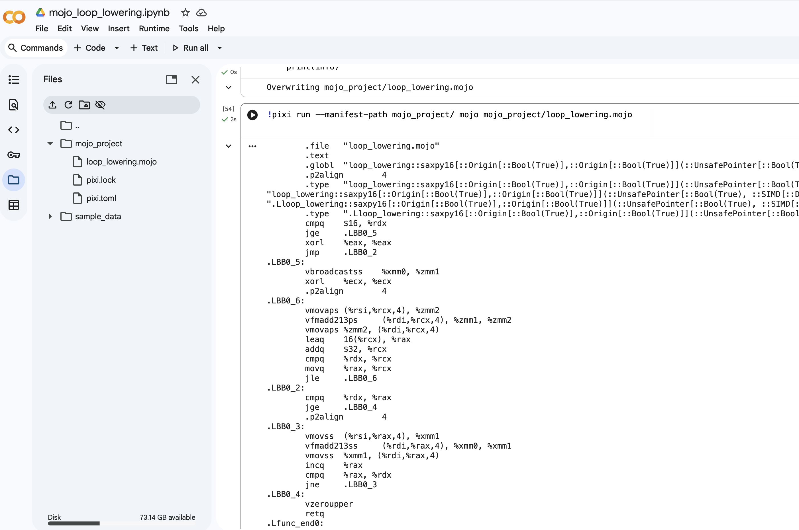

Chapter X - CPU hyperscaling for Mojo Programmers
-

Modern CPU performance no longer comes from increasing clock frequency.
Instead, it comes from _hyperscaling_: architectural techniques that expand
parallelism, bandwidth, and compute density far faster than frequency ever
could.

For Mojo developers - especially those writing HPC kernels - the implications
are profound:

* Mojo data layout ⇒ determines SIMD throughput
* Loop structure ⇒ determines OoO (i.e., _Out Of Order_) SIMD throughput
* Memory access pattern ⇒ determines whether a CPU is compute-boujnd or stalled
* Choosing AoS vs SoA ⇒ can enable or disable hyperscaling.

p.s. the last point is particularly interesting.

1. Vector Hyperscaling: The Heart of Modern CPU throughput
--

Mojo is designed to generate machine code that maps directly to wide vector
units. This makes SIMD the primary vehicle of hyperscaling in Mojo. Below is an
illustration of how the hardware aspect of SIMD has expanded in its capacity:

| ISA | Vector Width | Lane Count (F32) | Typical Speedup |
|-- | -- | -- | -- |
| SSE | 128-bit | 4 | 4x |
| AVX | 256-bit | 8 | 8x |
| AVX-512 | 512-bit | 16 | 16x |
| AMX (Intel) | Tile registers | 8K-bit equivalent | 30-50x GEMM |
| RVV | 128-4096-bit | Variable | 4-128x |

Impacts?
When writing kernels, the compiler prefers structure-of-arrays and contiguous,
stride-1 patterns. These allow vector load/stores like:

```asm
vmovaps zmm0, [x + i*64] ; loads 16 floats at once
```

Deep dive into the Mojo code
--

The classical example to use would be the following:

```pre
y[i] = a * x[i] + y[i]
```

using `SIMD[Float32, 16]` which translate to the 16-lanes where each lane is
32-bits _wide_. If the architecture supports those instructions mentioned
earlier, then we should see instructions like `zmm` and `vmfadd` in the assembly
code. Checkout the code, in Mojo:

```mojo
# Use Mojo compiler version 0.26
from memory import UnsafePointer
from sys import align_of
from builtin.simd import SIMD
from compile import compile_info

fn saxpy16(
    y: UnsafePointer[mut=True, Scalar[DType.float32]],
    x: UnsafePointer[mut=True, Scalar[DType.float32]],
    n: Int,
    a: Float32,
):
    comptime W = 16
    va = SIMD[DType.float32, W](a)

    # Alignment for vector load/store (safe choice for 16x f32)
    comptime ALIGN = align_of[SIMD[DType.float32, W]]()

    var i: Int = 0
    while i + W <= n:
      vx = (x + i).load[width=W, alignment=ALIGN]()
      vy = (y + i).load[width=W, alignment=ALIGN]()
      (y + i).store[width=W, alignment=ALIGN](va * vx + vy)
      i += W

    # Scalar tail
    while i < n:
      xi = (x + i).load[width=1]()
      yi = (y + i).load[width=1]()
      (y + i).store[width=1](a * xi + yi)
      i += 1

fn main():
    info = compile_info[saxpy16]()
    print(info)
```

The next thing to accomplish is to have Mojo lower ordinary loops into AMX files

* for this to happen, you will typically need __tile intrinsics__ (or a library)
  to get AMX, and then you will definitely see assembly instructions like `tileload`,
`ldtilecfg`, `tileloadd*`, `tdp*`, `tilestored` and `tilerelease`, in the
generated assembly.
  * Note: this does not necessarily mean that its runnable (or executable) as
  the CPU architecture chipset must match or at least be compatible.

Avoiding AoS means Mojo can lower your loop into AVX-512 or AMX tiles w/o
re-writing the algorithm. Here's an example (see [source code](./src/00_loop_lowering.mojo)), when it happens:

```pre
     .file "loop_lowering.mojo"
     .text
     .globl "loop_lowering::saxpy16[::Origin[::Bool(True)],::Origin[::Bool(True)]](::UnsafePointer[::Bool(True), ::SIMD[::DType(float32), ::Int(1)], $0, ::AddressSpace(::Int(0))],::UnsafePointer[::Bool(True), ::SIMD[::DType(float32), ::Int(1)], $1, ::AddressSpace(::Int(0))],::Int,::SIMD[::DType(float32), ::Int(1)])"
     .p2align 4
     .type "loop_lowering::saxpy16[::Origin[::Bool(True)],::Origin[::Bool(True)]](::UnsafePointer[::Bool(True), ::SIMD[::DType(float32), ::Int(1)], $0, ::AddressSpace(::Int(0))],::UnsafePointer[::Bool(True), ::SIMD[::DType(float32), ::Int(1)], $1, ::AddressSpace(::Int(0))],::Int,::SIMD[::DType(float32), ::Int(1)])",@function
"loop_lowering::saxpy16[::Origin[::Bool(True)],::Origin[::Bool(True)]](::UnsafePointer[::Bool(True), ::SIMD[::DType(float32), ::Int(1)], $0, ::AddressSpace(::Int(0))],::UnsafePointer[::Bool(True), ::SIMD[::DType(float32), ::Int(1)], $1, ::AddressSpace(::Int(0))],::Int,::SIMD[::DType(float32), ::Int(1)])":
".Lloop_lowering::saxpy16[::Origin[::Bool(True)],::Origin[::Bool(True)]](::UnsafePointer[::Bool(True), ::SIMD[::DType(float32), ::Int(1)], $0, ::AddressSpace(::Int(0))],::UnsafePointer[::Bool(True), ::SIMD[::DType(float32), ::Int(1)], $1, ::AddressSpace(::Int(0))],::Int,::SIMD[::DType(float32), ::Int(1)])$local":
     .type ".Lloop_lowering::saxpy16[::Origin[::Bool(True)],::Origin[::Bool(True)]](::UnsafePointer[::Bool(True), ::SIMD[::DType(float32), ::Int(1)], $0, ::AddressSpace(::Int(0))],::UnsafePointer[::Bool(True), ::SIMD[::DType(float32), ::Int(1)], $1, ::AddressSpace(::Int(0))],::Int,::SIMD[::DType(float32), ::Int(1)])$local",@function
     cmpq $16, %rdx
     jge .LBB0_5
     xorl %eax, %eax
     jmp .LBB0_2
.LBB0_5:
     vbroadcastss %xmm0, %zmm1
     xorl %ecx, %ecx
     .p2align 4
.LBB0_6:
     vmovaps (%rsi,%rcx,4), %zmm2
     vfmadd213ps (%rdi,%rcx,4), %zmm1, %zmm2
     vmovaps %zmm2, (%rdi,%rcx,4)
     leaq 16(%rcx), %rax
     addq $32, %rcx
     cmpq %rdx, %rcx
     movq %rax, %rcx
     jle .LBB0_6
.LBB0_2:
     cmpq %rdx, %rax
     jge .LBB0_4
     .p2align 4
.LBB0_3:
     vmovss (%rsi,%rax,4), %xmm1
     vfmadd213ss (%rdi,%rax,4), %xmm0, %xmm1
     vmovss %xmm1, (%rdi,%rax,4)
     incq %rax
     cmpq %rax, %rdx
     jne .LBB0_3
.LBB0_4:
     vzeroupper
     retq
.Lfunc_end0:
     .size "loop_lowering::saxpy16[::Origin[::Bool(True)],::Origin[::Bool(True)]](::UnsafePointer[::Bool(True), ::SIMD[::DType(float32), ::Int(1)], $0, ::AddressSpace(::Int(0))],::UnsafePointer[::Bool(True), ::SIMD[::DType(float32), ::Int(1)], $1, ::AddressSpace(::Int(0))],::Int,::SIMD[::DType(float32), ::Int(1)])", .Lfunc_end0-"loop_lowering::saxpy16[::Origin[::Bool(True)],::Origin[::Bool(True)]](::UnsafePointer[::Bool(True), ::SIMD[::DType(float32), ::Int(1)], $0, ::AddressSpace(::Int(0))],::UnsafePointer[::Bool(True), ::SIMD[::DType(float32), ::Int(1)], $1, ::AddressSpace(::Int(0))],::Int,::SIMD[::DType(float32), ::Int(1)])"
     .size ".Lloop_lowering::saxpy16[::Origin[::Bool(True)],::Origin[::Bool(True)]](::UnsafePointer[::Bool(True), ::SIMD[::DType(float32), ::Int(1)], $0, ::AddressSpace(::Int(0))],::UnsafePointer[::Bool(True), ::SIMD[::DType(float32), ::Int(1)], $1, ::AddressSpace(::Int(0))],::Int,::SIMD[::DType(float32), ::Int(1)])$local", .Lfunc_end0-"loop_lowering::saxpy16[::Origin[::Bool(True)],::Origin[::Bool(True)]](::UnsafePointer[::Bool(True), ::SIMD[::DType(float32), ::Int(1)], $0, ::AddressSpace(::Int(0))],::UnsafePointer[::Bool(True), ::SIMD[::DType(float32), ::Int(1)], $1, ::AddressSpace(::Int(0))],::Int,::SIMD[::DType(float32), ::Int(1)])"
    
     .section ".note.GNU-stack","",@progbits
```

Refer to the screenshot of it in action in Google Colab environment .

Similary, if you wish to see the raw generated assembly, the current Mojo
compiler (version 0.26) provides the facility `mojo build --emit=asm <filename>`
and it can be passed along to _pixi_ to execute.

```mojo
!pixi run --manifest-path mojo_project/ mojo build --emit=asm mojo_project/loop_lowering.mojo
```

A minimal C++ AMX "smoke test"
--

Here's a contrived example, that performs the following:

* Loads a tile config
* Performs a dot-product "tile" operation
* Releases tiles

```c++
#include <immintrin.h>
#include <stdint.h>

extern "C" void amx_smoke(
  const uint8_t* A,
  const int8_t* B, 
  int32_t* C, 
  int lda, int ldb, int ldc) {

  // 64-bbyte aligned tile config (Intel AMX requirement)
  alignas(64) struct {
  uint8_t palette_id;
  uint8_t start_row;
  uint8_t reserved[15];
  uint8_t colsb[8];
  uint8_t rows[8];
  } cfg = {};

  cfg.palette_id = 1;
  cfg.colsb[0] = 64; cfg.rows[0] = 16; // tmm0
  cfg.colsb[1] = 64; cfg.rows[1] = 16; // tmm1
  cfg.colsb[2] = 64; cfg.rows[2] = 16; // tmm2

  _tile_loadconfig(&cfg);

  // Load tiles (interpret strides in bytes)
  _tile_loadd(0, A, lda);
  _tile_loadd(1, B, ldb);

  // dot-product accumulate (int8 -> int32)
  // tdpbssd: signed*signed dword accumulate
  _tile_dpbssd(2, 0, 1);

  _tile_stored(2, C, ldc);

  _tile_release();
}
```
